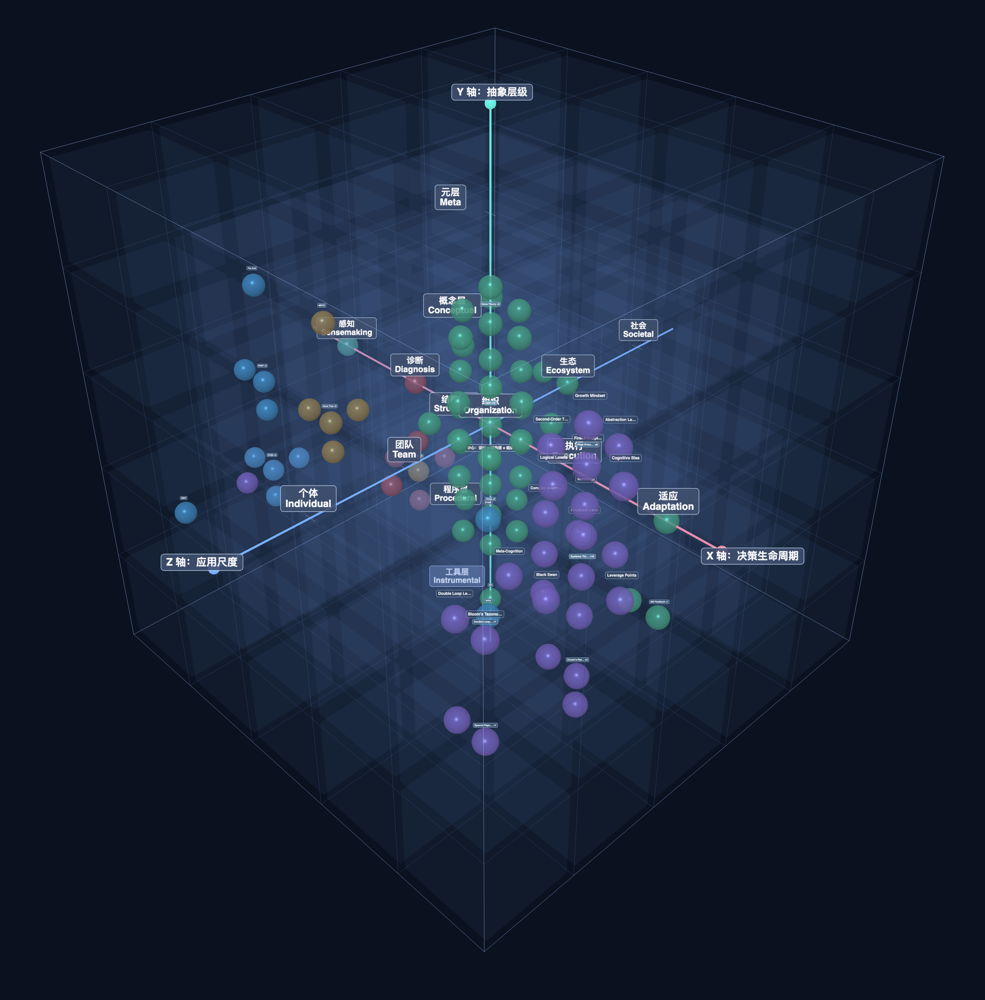

# Cognitive Atlas

[](LICENSE)



`Cognitive Atlas` is a knowledge map for cognitive objects (models, frameworks, principles, methods, tools, etc.). It helps people quickly find the right object, understand when to use it, and keep learning through nearby related objects.

Under the surface, the Atlas keeps a stable coordinate system, typed knowledge objects, and graph relations so the same knowledge can also be referenced by AI systems in a structured way.

---

## ✨ Features

- **Find and compare objects quickly**: browse a 3D atlas of models, frameworks, principles, methods, and tools
- **Learn by following connections**: jump through nearby, related, and same-cell objects to continue exploring
- **Human-first, machine-solid structure**: the UI stays readable while `objectType`, coordinates, relations, confidence, and status remain structured underneath
- **Shareable state**: URL query keeps language, view, filters, and panel state for sharing
- **Embed mode**: lightweight embedded entry (`embed.html`) plus branded entry alias support
- **i18n**: Chinese and English support
- **Validation gates**: structure, content, E2E, and perf checks keep the Atlas consistent as it grows

---

## 📦 Installation

No build step. Requires a static HTTP server and a modern browser.

**Requirements**: Python 3.x (for `http.server`) or Node.js (for `npx serve`), or any static file server.

---

## 🚀 Quick start

```bash
git clone https://github.com/NESNILNEHC/Cognitive-Atlas.git
cd Cognitive-Atlas
python3 -m http.server 8000
```

If port 8000 is in use, try another port: `python3 -m http.server 8001` and open `http://localhost:8001`.  
Or use `npx serve` (picks an available port automatically).

Open [http://localhost:8000](http://localhost:8000). The index redirects to the branded entry page (`cognitive-atlas.html`), while the legacy route (`cognitive-model-3d.html`) remains supported for compatibility.

### Deploy to GitHub Pages

1. Push the repo to GitHub.
2. Go to **Settings → Pages**.
3. Source: **Deploy from a branch**.
4. Branch: `main`, folder: `/ (root)`.
5. Save. The site will be available at `https://<username>.github.io/Cognitive-Atlas/` (or your repository path).

No build step needed. The project uses relative paths, so it runs correctly under the project subpath.

---

## 📖 Usage / configuration

- **Search**: type an object name or term (e.g. MECE / OKR) to filter the 3D view
- **Explore**: click a node to see what it is, when to use it, and related objects
- **Language**: switch between 中文 and English in the UI
- **State sharing**: copy the browser URL to share the current view/filter/language state

### Embed mode

- Open `http://localhost:8000/embed.html` for a simplified embedded view
- You can still pass query parameters (they are merged with `simple=1&embed=1`)

### Maintenance commands

```bash
# Validate model data - structure (same as CI)
npm run validate

# Validate model data - content governance (same as CI)
npm run validate:content

# Generate changelog lines from git diff (when editing model-library.js)
npm run changelog:diff

# Run E2E regression checks (i18n, filters, cell focus, related jumps, URL restore, embed, export)
npm run smoke:e2e

# Run perf budget baseline on 100+ nodes (first-screen, FPS, export latency)
npm run perf:budget

# Export promo image for README (start server first, e.g. python3 -m http.server 8080)
npm run export-promo

# Remove local temp screenshots
rm -f .tmp-*.png
```

To update the promo image: run `npm run export-promo` (with the server running on port 8080), or open the Atlas view, click **推广图视角** and **导出图片**, then save as `docs/assets/cognitive-atlas-promo.png`.

### Project structure

| Path | Purpose |
| ------ | ------- |
| `index.html` | Entry redirect to the branded Atlas page |
| `cognitive-atlas.html` | Primary branded entry route |
| `cognitive-model-3d.html` | Legacy route alias kept for compatibility |
| `data/model-library.js` | Legacy source rows, evidence bundles, references, and relation edges |
| `src/app.js` | Main app logic (render, filters, details, i18n, validation) |
| `src/domain/model-data.js` | Knowledge object shaping, admission mapping, v2 coordinate projection, relation payload assembly |
| `src/app3d/*.js` | Reusable modules (i18n, filters, scene, interaction, export, URL state, detail orchestration) |
| `scripts/validate-model-data.mjs` | Data validation script |
| `docs/` | Classification standards, architecture, design docs (including Cognitive Atlas v2 spec) |

See [docs/project-overview/project-file-map.md](docs/project-overview/project-file-map.md) for the full file map.  
See [docs/requirements-planning/cognitive-atlas-v2-system-spec.md](docs/requirements-planning/cognitive-atlas-v2-system-spec.md) for the v2 ontology and strict classification gate.

---

## 🤝 Contributing

1. Fork the repository
2. Create a feature branch
3. Run `npm run validate`, `npm run validate:content`, `npm run smoke:e2e`, and `npm run perf:budget` before committing
4. If you changed `data/model-library.js`, update `docs/changelog/model-library-changelog.md`
5. Open a pull request

**CI gates:** Structure validation, content governance validation, E2E regression, and perf budget all run on push/PR. Any failure **blocks merge**.

---

## 📄 License

[LICENSE](LICENSE) (MIT). See the LICENSE file for details.

---

## 👤 Authors and acknowledgments

- **NESNILNEHC** – Cognitive Atlas
- Three.js (vendored) – 3D rendering
- See `docs/` for classification standards and design decisions
