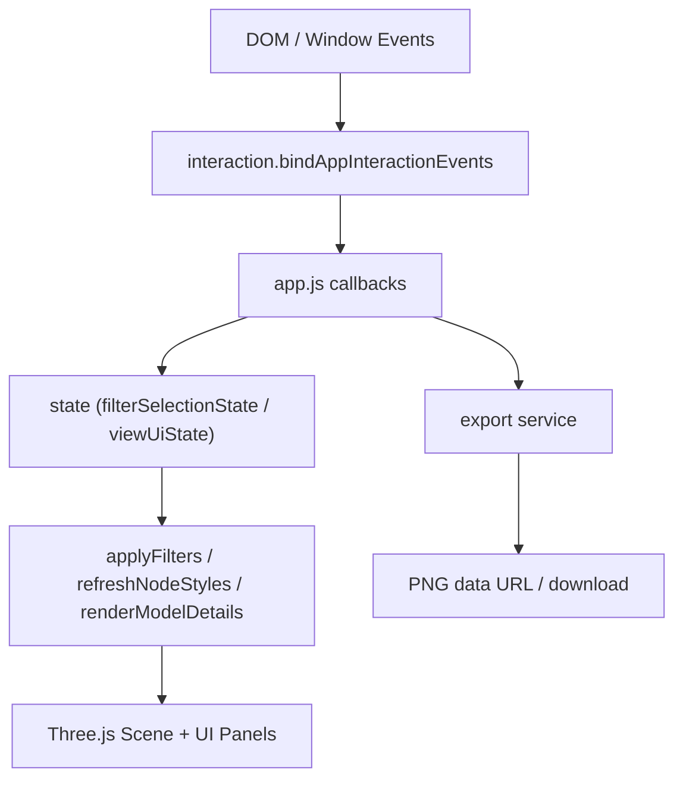

# ModelSpace M1 模块边界与事件流

**Date:** 2026-03-05  
**Status:** Implemented (Phase 1)

## 目标

将 `src/app.js` 从“大而全入口”调整为“编排层”，把稳定能力抽离到独立模块，降低耦合并支持后续迭代。

## 当前模块边界

| 模块 | 责任 | 输入 | 输出 |
| --- | --- | --- | --- |
| `src/app.js` | 应用编排层：初始化 Three.js、串联 state/interaction/export、组织渲染与业务流程 | DOM、模型数据、各子模块 | 页面行为与渲染结果 |
| `src/app3d/state.js` | 状态初始化：筛选选择状态、视图与交互状态 | `modelData`、默认语言 | `filterSelectionState`、`viewUiState` |
| `src/app3d/interaction.js` | 事件绑定：把 DOM/窗口事件统一映射到业务回调 | 元素集合、回调集合 | 绑定后的交互通道 |
| `src/app3d/export.js` | 导出服务：导出裁剪、标签缩放、PNG data URL | 渲染器、相机、场景、视觉配置 | `getExportDataUrl`、`exportCanvasImage` |
| `src/app3d/scene.js` | Three.js 通用构建工具 | 几何参数、材质参数 | 线、精灵、网格构件 |
| `src/app3d/ui.js` | 详情与校验面板渲染 | 文案、模型详情 payload、校验快照 | 结构化 DOM 节点 |
| `src/app3d/filters.js` | 筛选与排序工具函数 | 模型对象、单元键 | 可搜索文本、排序/标签工具 |
| `src/app3d/i18n.js` | 文案与轴文本字典 | 语言 key | UI 文案与轴标签文本 |
| `src/layout.js` | 模型坐标布局规则 | `MODEL_LIBRARY_ROWS` | 三维坐标化模型数据 |

## 事件流（M1）

## 渲染与状态收敛点

1. 交互输入统一先进入 callback。
2. callback 只改状态，不直接散落修改 DOM。
3. 状态变更后由收敛函数触发更新：
   - `applyFilters()`
   - `refreshNodeStyles()`
   - `renderModelDetails()`
   - `updateViewControlsState()`

## M1 验证结论

- `npm run validate` 通过
- `npm run smoke:e2e` 通过
- `smoke:e2e` 已接入 CI 工作流

